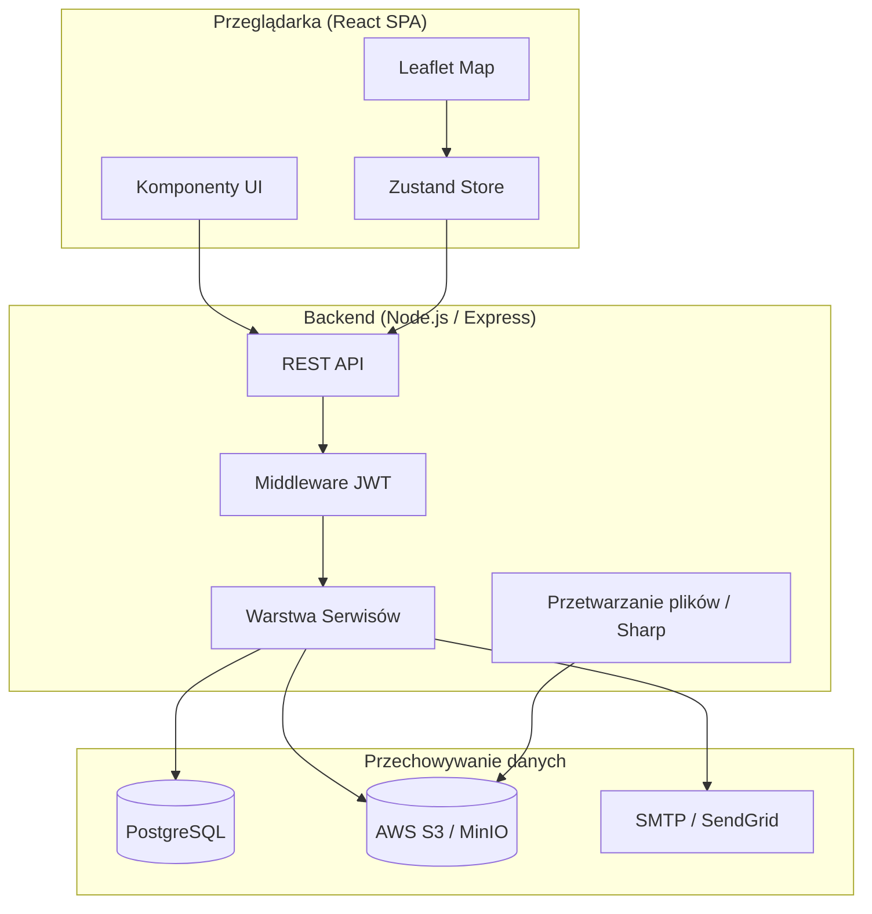
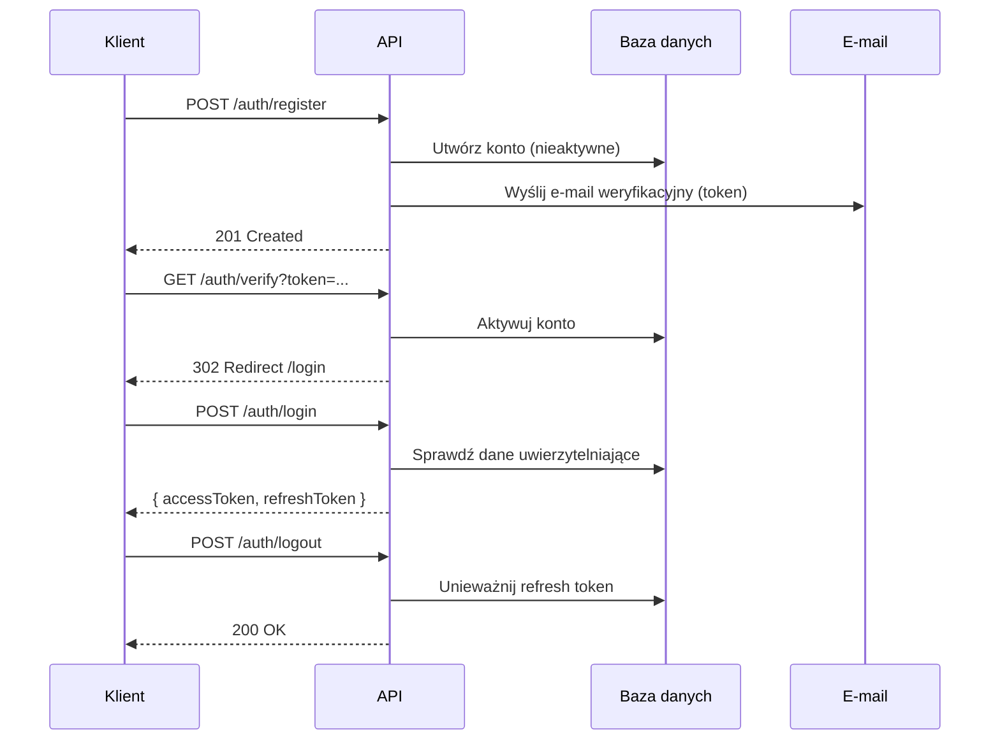

# Dokument Projektowy: Platforma Katalogowania Znalezisk Detektorystów

## Przegląd (Overview)

Platforma dla detektorystów to aplikacja webowa typu SPA (Single Page Application) z backendowym API REST. Umożliwia użytkownikom rejestrację kont, zarządzanie profilem, katalogowanie znalezisk z metadanymi geograficznymi i zdjęciami, a także przeglądanie znalezisk na interaktywnej mapie.

### Stos technologiczny

| Warstwa | Technologia | Uzasadnienie |
|---|---|---|
| Frontend | React 18 + TypeScript | Dojrzały ekosystem, silne typowanie, bogata biblioteka komponentów |
| Routing (FE) | React Router v6 | Standard dla SPA w React |
| Zarządzanie stanem | Zustand | Lekki, prosty w użyciu, bez boilerplate Redux |
| Stylowanie | Tailwind CSS | Utility-first, szybkie prototypowanie, spójny design system |
| Mapy | Leaflet + React-Leaflet | Open-source, darmowy, bogaty ekosystem pluginów (w tym klastrowanie) |
| Klastrowanie | Leaflet.markercluster | Dedykowany plugin do grupowania znaczników |
| Backend | Node.js + Express + TypeScript | Jednolity język po obu stronach, duży ekosystem |
| ORM | Prisma | Type-safe, migracje, wsparcie dla PostgreSQL |
| Baza danych | PostgreSQL | Relacyjna, wsparcie dla typów geograficznych (PostGIS opcjonalnie) |
| Przechowywanie plików | AWS S3 (lub MinIO lokalnie) | Skalowalne, tanie, CDN-ready |
| Przetwarzanie obrazów | Sharp | Wydajne generowanie miniatur w Node.js |
| Uwierzytelnianie | JWT (access + refresh token) | Bezstanowe, skalowalne |
| Wysyłka e-mail | Nodemailer + SMTP / SendGrid | Weryfikacja konta, reset hasła |
| Testy jednostkowe | Vitest | Szybki, kompatybilny z Vite, wsparcie TypeScript |
| Testy właściwości | fast-check | Dojrzała biblioteka PBT dla TypeScript/JavaScript |

---

## Architektura

### Diagram wysokopoziomowy



### Diagram przepływu uwierzytelniania



### Strategia tokenów JWT

- **Access token**: ważność 15 minut, przechowywany w pamięci (nie w localStorage)
- **Refresh token**: ważność 7 dni, przechowywany w httpOnly cookie
- **Rotacja tokenów**: przy każdym odświeżeniu access tokena generowany jest nowy refresh token (stary unieważniany)
- **Sesja nieaktywna**: refresh token wygasa po 60 minutach braku aktywności (sliding expiration)

---

## Komponenty i Interfejsy

### Struktura katalogów

```
/
├── frontend/
│   ├── src/
│   │   ├── components/       # Komponenty wielokrotnego użytku
│   │   │   ├── auth/         # Formularze logowania, rejestracji
│   │   │   ├── finds/        # Karty znalezisk, formularze
│   │   │   ├── map/          # Komponenty mapy
│   │   │   └── ui/           # Przyciski, inputy, modale
│   │   ├── pages/            # Strony (route-level components)
│   │   ├── stores/           # Zustand stores
│   │   ├── services/         # Klienty API (fetch wrappers)
│   │   ├── hooks/            # Custom React hooks
│   │   └── types/            # Typy TypeScript
│   └── ...
├── backend/
│   ├── src/
│   │   ├── routes/           # Express route handlers
│   │   ├── services/         # Logika biznesowa
│   │   ├── middleware/        # Auth, walidacja, obsługa błędów
│   │   ├── utils/            # Pomocnicze funkcje
│   │   └── types/            # Typy TypeScript
│   ├── prisma/
│   │   └── schema.prisma     # Schemat bazy danych
│   └── ...
└── shared/
    └── types/                # Typy współdzielone FE/BE
```

### Endpointy REST API

#### Uwierzytelnianie

| Metoda | Ścieżka | Opis |
|---|---|---|
| POST | `/api/auth/register` | Rejestracja nowego konta |
| GET | `/api/auth/verify` | Weryfikacja adresu e-mail (token w query) |
| POST | `/api/auth/login` | Logowanie, zwraca tokeny |
| POST | `/api/auth/logout` | Wylogowanie, unieważnia refresh token |
| POST | `/api/auth/refresh` | Odświeżenie access tokena |
| POST | `/api/auth/forgot-password` | Żądanie resetu hasła |
| POST | `/api/auth/reset-password` | Reset hasła tokenem |

#### Profil użytkownika

| Metoda | Ścieżka | Opis |
|---|---|---|
| GET | `/api/users/me` | Pobierz dane profilu |
| PATCH | `/api/users/me` | Zaktualizuj profil |
| POST | `/api/users/me/avatar` | Wgraj zdjęcie profilowe |
| PUT | `/api/users/me/password` | Zmień hasło |

#### Znaleziska

| Metoda | Ścieżka | Opis |
|---|---|---|
| GET | `/api/finds` | Lista znalezisk (paginacja, filtrowanie, sortowanie) |
| POST | `/api/finds` | Utwórz nowe znalezisko |
| GET | `/api/finds/:id` | Szczegóły znaleziska |
| PATCH | `/api/finds/:id` | Zaktualizuj znalezisko |
| DELETE | `/api/finds/:id` | Usuń znalezisko (kaskadowo) |
| GET | `/api/finds/map` | Znaleziska z współrzędnymi (dla mapy) |

#### Zdjęcia znalezisk

| Metoda | Ścieżka | Opis |
|---|---|---|
| POST | `/api/finds/:id/photos` | Wgraj zdjęcie |
| DELETE | `/api/finds/:id/photos/:photoId` | Usuń zdjęcie |
| PATCH | `/api/finds/:id/photos/:photoId/cover` | Ustaw jako okładkowe |

#### Atrybuty znalezisk

| Metoda | Ścieżka | Opis |
|---|---|---|
| POST | `/api/finds/:id/attributes` | Dodaj atrybut |
| PATCH | `/api/finds/:id/attributes/:attrId` | Zaktualizuj atrybut |
| DELETE | `/api/finds/:id/attributes/:attrId` | Usuń atrybut |

### Parametry zapytań dla listy znalezisk

```
GET /api/finds?page=1&limit=20&search=moneta&sortBy=discoveryDate&sortOrder=desc
```

| Parametr | Typ | Domyślna wartość | Opis |
|---|---|---|---|
| `page` | number | 1 | Numer strony |
| `limit` | number | 20 | Liczba wyników na stronę |
| `search` | string | — | Fraza do wyszukania w nazwie/opisie |
| `sortBy` | enum | `createdAt` | Pole sortowania: `createdAt`, `discoveryDate`, `name` |
| `sortOrder` | enum | `desc` | Kierunek: `asc`, `desc` |

---

## Modele Danych

### Schemat Prisma

```prisma
model User {
  id            String    @id @default(cuid())
  email         String    @unique
  username      String    @unique
  passwordHash  String
  firstName     String?
  lastName      String?
  bio           String?
  avatarUrl     String?
  isVerified    Boolean   @default(false)
  createdAt     DateTime  @default(now())
  updatedAt     DateTime  @updatedAt

  finds         Find[]
  sessions      Session[]
  verifyTokens  VerificationToken[]
  resetTokens   PasswordResetToken[]
}

model Session {
  id           String   @id @default(cuid())
  userId       String
  refreshToken String   @unique
  expiresAt    DateTime
  lastActiveAt DateTime @default(now())
  createdAt    DateTime @default(now())

  user         User     @relation(fields: [userId], references: [id], onDelete: Cascade)
}

model VerificationToken {
  id        String   @id @default(cuid())
  userId    String
  token     String   @unique
  expiresAt DateTime
  usedAt    DateTime?
  createdAt DateTime @default(now())

  user      User     @relation(fields: [userId], references: [id], onDelete: Cascade)
}

model PasswordResetToken {
  id        String   @id @default(cuid())
  userId    String
  token     String   @unique
  expiresAt DateTime
  usedAt    DateTime?
  createdAt DateTime @default(now())

  user      User     @relation(fields: [userId], references: [id], onDelete: Cascade)
}

model Find {
  id            String      @id @default(cuid())
  userId        String
  name          String
  description   String?
  discoveryDate DateTime?
  latitude      Float?
  longitude     Float?
  createdAt     DateTime    @default(now())
  updatedAt     DateTime    @updatedAt

  user          User        @relation(fields: [userId], references: [id], onDelete: Cascade)
  photos        Photo[]
  attributes    Attribute[]
}

model Photo {
  id          String   @id @default(cuid())
  findId      String
  url         String
  thumbnailUrl String
  isCover     Boolean  @default(false)
  sizeBytes   Int
  mimeType    String
  createdAt   DateTime @default(now())

  find        Find     @relation(fields: [findId], references: [id], onDelete: Cascade)
}

model Attribute {
  id        String   @id @default(cuid())
  findId    String
  key       String
  value     String
  createdAt DateTime @default(now())
  updatedAt DateTime @updatedAt

  find      Find     @relation(fields: [findId], references: [id], onDelete: Cascade)
}
```

### Typy TypeScript (współdzielone)

```typescript
// Odpowiedź API - paginacja
interface PaginatedResponse<T> {
  data: T[];
  pagination: {
    page: number;
    limit: number;
    total: number;
    totalPages: number;
  };
}

// Walidacja współrzędnych
interface Coordinates {
  latitude: number;   // zakres: [-90, 90]
  longitude: number;  // zakres: [-180, 180]
}

// Znalezisko na mapie (uproszczone)
interface FindMapMarker {
  id: string;
  name: string;
  latitude: number;
  longitude: number;
  coverThumbnailUrl: string | null;
}

// Walidacja pliku
interface FileValidationResult {
  valid: boolean;
  error?: 'FILE_TOO_LARGE' | 'UNSUPPORTED_FORMAT';
}
```

---

## Właściwości Poprawności (Correctness Properties)

*Właściwość to cecha lub zachowanie, które powinno być prawdziwe dla wszystkich poprawnych wykonań systemu — formalny opis tego, co system powinien robić. Właściwości stanowią pomost między czytelną dla człowieka specyfikacją a weryfikowalnymi maszynowo gwarancjami poprawności.*

### Właściwość 1: Unikalność danych rejestracji

*Dla każdego* adresu e-mail lub nazwy użytkownika już zarejestrowanego w systemie, próba rejestracji z tym samym adresem e-mail lub tą samą nazwą użytkownika powinna zostać odrzucona z odpowiednim komunikatem błędu, a nowe konto nie powinno zostać utworzone.

**Validates: Requirements 1.3, 1.4, 3.3**

---

### Właściwość 2: Walidacja hasła

*Dla każdego* ciągu znaków o długości mniejszej niż 8, próba rejestracji lub zmiany hasła na taki ciąg powinna zostać odrzucona. *Dla każdej* pary ciągów znaków, gdzie hasło i potwierdzenie hasła są różne, operacja powinna zostać odrzucona.

**Validates: Requirements 1.5, 1.6, 4.4, 4.5**

---

### Właściwość 3: Weryfikacja konta — round trip

*Dla każdego* nowo zarejestrowanego konta, token weryfikacyjny wysłany e-mailem powinien aktywować konto dokładnie raz — ponowne użycie tego samego tokenu powinno zostać odrzucone.

**Validates: Requirements 1.2, 1.7**

---

### Właściwość 4: Bezpieczeństwo komunikatów błędów logowania

*Dla każdej* próby logowania z niepoprawnymi danymi (błędny e-mail lub błędne hasło), system powinien zwrócić identyczny komunikat błędu niezależnie od tego, które pole jest nieprawidłowe.

**Validates: Requirements 2.3**

---

### Właściwość 5: Unieważnianie sesji po wylogowaniu

*Dla każdej* aktywnej sesji, po wylogowaniu token sesji powinien być nieważny — każde kolejne żądanie z tym tokenem powinno zostać odrzucone z błędem 401.

**Validates: Requirements 2.5**

---

### Właściwość 6: Zmiana hasła unieważnia inne sesje

*Dla każdego* użytkownika z wieloma aktywnymi sesjami, po zmianie hasła wszystkie sesje z wyjątkiem bieżącej powinny zostać unieważnione.

**Validates: Requirements 4.2**

---

### Właściwość 7: Reset hasła — jednorazowy token

*Dla każdego* tokenu resetowania hasła, użycie go do zmiany hasła powinno unieważnić token — ponowna próba użycia tego samego tokenu powinna zostać odrzucona.

**Validates: Requirements 4.6**

---

### Właściwość 8: Walidacja pliku graficznego

*Dla każdego* pliku o formacie innym niż JPEG, PNG lub WebP, lub o rozmiarze przekraczającym limit (5 MB dla avatara, 10 MB dla zdjęcia znaleziska), próba wgrania powinna zostać odrzucona. *Dla każdego* pliku spełniającego wymagania formatowe i rozmiarowe, wgranie powinno zakończyć się sukcesem.

**Validates: Requirements 3.4, 3.5, 6.2, 6.3**

---

### Właściwość 9: Walidacja współrzędnych geograficznych

*Dla każdej* wartości szerokości geograficznej spoza zakresu [-90, 90] lub długości geograficznej spoza zakresu [-180, 180], walidacja powinna zwrócić błąd i nie zapisać znaleziska.

**Validates: Requirements 5.4**

---

### Właściwość 10: Tworzenie znaleziska — round trip

*Dla każdego* zestawu poprawnych danych znaleziska (niepusta nazwa), po zapisaniu znalezisko powinno być pobieralne przez API i zawierać wszystkie przekazane dane, a jego właścicielem powinien być tworzący użytkownik.

**Validates: Requirements 5.2, 5.3**

---

### Właściwość 11: Limit zdjęć znaleziska

*Dla każdego* znaleziska posiadającego już 10 zdjęć, próba wgrania kolejnego zdjęcia powinna zostać odrzucona.

**Validates: Requirements 6.1**

---

### Właściwość 12: Generowanie miniatury

*Dla każdego* poprawnie wgranego zdjęcia, system powinien wygenerować miniaturę dostępną pod osobnym URL-em.

**Validates: Requirements 6.4**

---

### Właściwość 13: Kaskadowe usuwanie zdjęcia

*Dla każdego* zdjęcia znaleziska, po jego usunięciu zarówno oryginalny plik jak i miniatura powinny być niedostępne.

**Validates: Requirements 6.5**

---

### Właściwość 14: Dokładnie jedno zdjęcie okładkowe

*Dla każdego* znaleziska z wieloma zdjęciami, po wyznaczeniu zdjęcia okładkowego dokładnie jedno zdjęcie powinno mieć flagę `isCover = true`.

**Validates: Requirements 6.6**

---

### Właściwość 15: Przechowywanie atrybutów — round trip

*Dla każdej* listy atrybutów (par klucz-wartość z niepustymi kluczami) dodanych do znaleziska, wszystkie atrybuty powinny być pobieralne ze znaleziska. Po usunięciu atrybutu nie powinien on pojawiać się na liście atrybutów znaleziska.

**Validates: Requirements 7.1, 7.2, 7.3, 7.5**

---

### Właściwość 16: Poprawność sortowania listy znalezisk

*Dla każdego* kryterium sortowania (data odkrycia, data dodania, nazwa) i dowolnego zbioru znalezisk, zwrócona lista powinna być posortowana zgodnie z wybranym kryterium i kierunkiem.

**Validates: Requirements 8.1, 8.5**

---

### Właściwość 17: Filtrowanie wyszukiwania

*Dla każdej* frazy wyszukiwania i dowolnego zbioru znalezisk, wszystkie zwrócone wyniki powinny zawierać tę frazę w nazwie lub opisie, a żadne nieodpowiadające znalezisko nie powinno się pojawić.

**Validates: Requirements 8.4**

---

### Właściwość 18: Paginacja

*Dla każdego* zbioru znalezisk o liczbie większej niż 20, odpowiedź API powinna zawierać co najwyżej 20 wyników na stronę wraz z metadanymi paginacji (total, totalPages).

**Validates: Requirements 8.3**

---

### Właściwość 19: Kaskadowe usuwanie znaleziska

*Dla każdego* znaleziska ze zdjęciami i atrybutami, po jego usunięciu ani znalezisko, ani żadne z jego zdjęć, ani żaden z jego atrybutów nie powinny być pobieralne przez API.

**Validates: Requirements 9.5**

---

### Właściwość 20: Zawartość popupu mapy

*Dla każdego* znaleziska ze współrzędnymi, dane zwracane przez endpoint mapy powinny zawierać: identyfikator, nazwę, współrzędne oraz URL miniatury okładki (lub null jeśli brak zdjęć).

**Validates: Requirements 10.2**

---

### Właściwość 21: Klastrowanie znaczników

*Dla każdego* zbioru 6 lub więcej znalezisk w bliskim sąsiedztwie geograficznym, logika klastrowania powinna je zgrupować w jeden klaster z poprawną liczbą elementów. Po zmniejszeniu liczby znalezisk w sąsiedztwie poniżej 6, klaster powinien zostać rozwiązany.

**Validates: Requirements 10.3, 10.5**

---

## Obsługa Błędów

### Kody błędów HTTP

| Kod | Zastosowanie |
|---|---|
| 200 | Sukces (GET, PATCH) |
| 201 | Zasób utworzony (POST) |
| 204 | Sukces bez treści (DELETE) |
| 400 | Błąd walidacji danych wejściowych |
| 401 | Brak uwierzytelnienia lub nieważny token |
| 403 | Brak uprawnień (np. próba edycji cudzego znaleziska) |
| 404 | Zasób nie istnieje |
| 409 | Konflikt (np. zajęty e-mail lub nazwa użytkownika) |
| 413 | Plik zbyt duży |
| 415 | Nieobsługiwany format pliku |
| 422 | Błąd semantyczny (np. nieprawidłowe współrzędne) |
| 500 | Wewnętrzny błąd serwera |

### Format odpowiedzi błędu

```typescript
interface ErrorResponse {
  error: {
    code: string;       // np. "EMAIL_ALREADY_EXISTS"
    message: string;    // czytelny komunikat
    field?: string;     // opcjonalnie: pole formularza
  };
}
```

### Kody błędów domenowych

```
AUTH_EMAIL_ALREADY_EXISTS
AUTH_USERNAME_ALREADY_EXISTS
AUTH_INVALID_CREDENTIALS
AUTH_ACCOUNT_NOT_VERIFIED
AUTH_TOKEN_INVALID
AUTH_TOKEN_EXPIRED
AUTH_TOKEN_ALREADY_USED
PASSWORD_TOO_SHORT
PASSWORD_MISMATCH
FILE_TOO_LARGE
FILE_UNSUPPORTED_FORMAT
FIND_NAME_REQUIRED
FIND_COORDINATES_INVALID
FIND_PHOTO_LIMIT_EXCEEDED
ATTRIBUTE_KEY_REQUIRED
```

### Strategia obsługi błędów po stronie frontendu

- Globalny interceptor Axios/fetch przechwytuje błędy 401 i inicjuje odświeżenie tokena
- Błędy walidacji formularzy wyświetlane są inline przy odpowiednich polach
- Błędy sieciowe i 5xx wyświetlane są jako toast notifications
- Błędy 403/404 przekierowują do dedykowanych stron błędów

---

## Strategia Testowania

### Podejście dualne

Testy dzielą się na dwie uzupełniające się kategorie:

1. **Testy jednostkowe / przykładowe** — weryfikują konkretne scenariusze, przypadki brzegowe i integrację komponentów
2. **Testy właściwości (PBT)** — weryfikują właściwości uniwersalne dla szerokiego zakresu danych wejściowych

### Testy właściwości (Property-Based Testing)

Biblioteka: **fast-check** (TypeScript/JavaScript)

Konfiguracja: minimum **100 iteracji** na każdy test właściwości.

Format tagu dla każdego testu:
```
// Feature: detectorist-finds-catalog, Property {numer}: {treść właściwości}
```

Każda z 21 właściwości zdefiniowanych w sekcji "Właściwości Poprawności" powinna być zaimplementowana jako osobny test PBT. Generatory fast-check powinny tworzyć:
- Losowe dane użytkowników (e-mail, username, hasło)
- Losowe dane znalezisk (nazwa, opis, współrzędne w i poza zakresem)
- Losowe atrybuty (pary klucz-wartość)
- Losowe metadane plików (format, rozmiar)

### Testy jednostkowe

Skupiają się na:
- Renderowaniu komponentów UI (React Testing Library)
- Logice walidacji formularzy
- Funkcjach pomocniczych (formatowanie dat, URL-i)
- Przypadkach brzegowych (puste listy, brak zdjęć, brak współrzędnych)

### Testy integracyjne

- Przepływy end-to-end: rejestracja → weryfikacja → logowanie → dodanie znaleziska
- Wgrywanie plików do S3 (z mockiem w testach jednostkowych, prawdziwy S3 w testach integracyjnych)
- Paginacja i sortowanie z rzeczywistą bazą danych (testowa instancja PostgreSQL)

### Testy dymne (Smoke Tests)

- Weryfikacja dostępności endpointów API po wdrożeniu
- Sprawdzenie połączenia z bazą danych
- Sprawdzenie dostępu do S3
- Weryfikacja konfiguracji mapy (Leaflet ładuje się poprawnie)

### Pokrycie testami

| Obszar | Typ testu | Priorytet |
|---|---|---|
| Walidacja danych wejściowych | PBT (Właściwości 1, 2, 8, 9) | Wysoki |
| Logika uwierzytelniania | PBT (Właściwości 3–7) | Wysoki |
| CRUD znalezisk | PBT (Właściwości 10, 19) | Wysoki |
| Zarządzanie zdjęciami | PBT (Właściwości 11–14) | Wysoki |
| Atrybuty | PBT (Właściwość 15) | Średni |
| Listowanie i wyszukiwanie | PBT (Właściwości 16–18) | Wysoki |
| Mapa i klastrowanie | PBT (Właściwości 20, 21) | Średni |
| Renderowanie UI | Testy jednostkowe | Średni |
| Przepływy E2E | Testy integracyjne | Wysoki |
